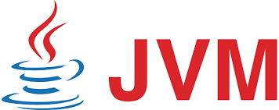

[![Build Status][travis-badge]][travis-badge-url]
[![Quality Gate][sonarqube-badge]][sonarqube-badge-url] 
[![Technical debt ratio][technical-debt-ratio-badge]][technical-debt-ratio-badge-url] 
[![Coverage][coverage-badge]][coverage-badge-url]



JVM Fun
==========
Exploring different aspects of JVM (Java Virtual Machine)

### References
1. Brent Boyer. [Robust Java benchmarking](https://www.ibm.com/developerworks/java/library/j-benchmark1/index.html).
 In _IBM DeveloperWorks_, June, 2008.
 
1. A. Georges, D. Buytaert, and L. Eeckhout. [Statistically Rigorous Java Performance Evaluation](./doc/Statistically%20Rigorous%20Java%20Performance%20Evaluation.pdf).
In _OOPSLA '07 Proceedings of the 22nd annual ACM SIGPLAN conference on 
Object-oriented programming systems and applications_, pages 57-76, 
October, 2007.

### Build
Execute the following command from the parent directory:
```
mvn clean install
```

### Run
To run the examples, please read the README of each child project.

[travis-badge]: https://travis-ci.org/indrabasak/jvm-fun.svg?branch=master
[travis-badge-url]: https://travis-ci.org/indrabasak/jvm-fun/

[sonarqube-badge]: https://sonarcloud.io/api/project_badges/measure?project=com.basaki%3Ajvm-fun&metric=alert_status
[sonarqube-badge-url]: https://sonarcloud.io/dashboard/index/com.basaki:jvm-fun 

[technical-debt-ratio-badge]: https://sonarcloud.io/api/project_badges/measure?project=com.basaki%3Ajvm-fun&metric=sqale_index
[technical-debt-ratio-badge-url]: https://sonarcloud.io/dashboard/index/com.basaki:jvm-fun

[coverage-badge]: https://sonarcloud.io/api/project_badges/measure?project=com.basaki%3Ajvm-fun&metric=coverage
[coverage-badge-url]: https://sonarcloud.io/dashboard/index/com.basaki:jvm-fun